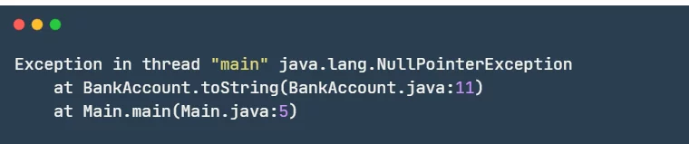
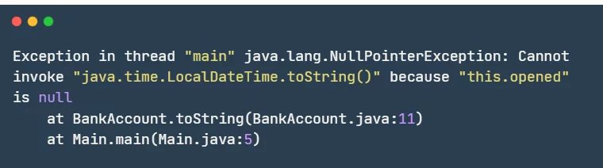
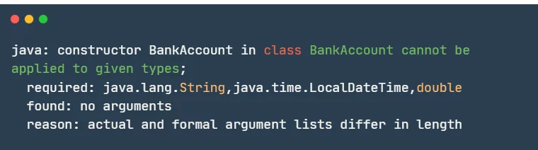
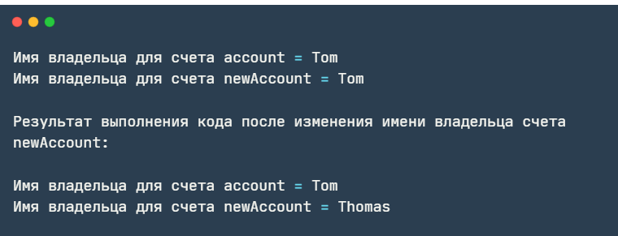
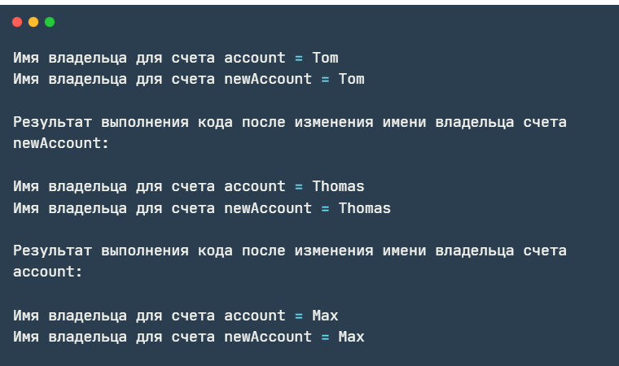
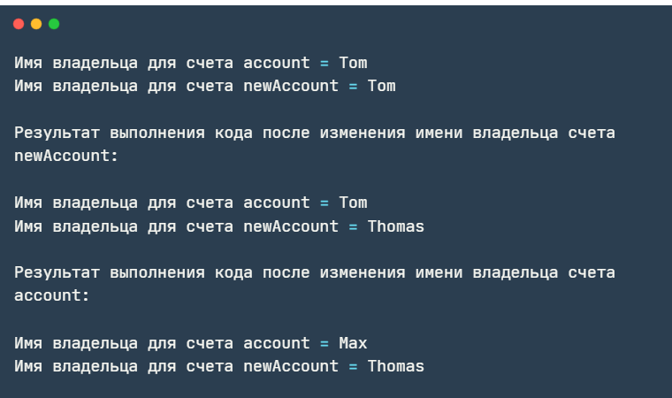
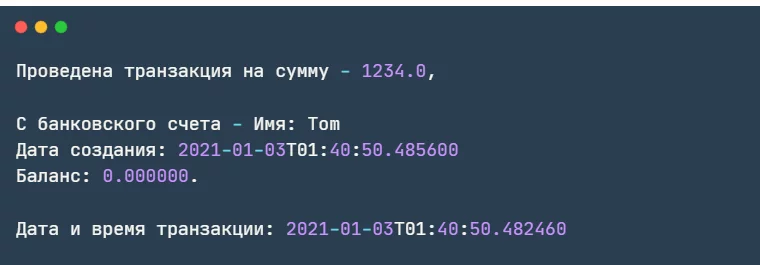
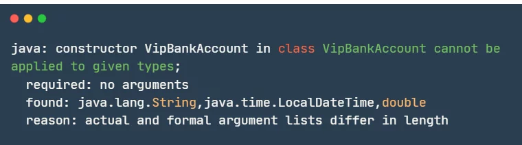
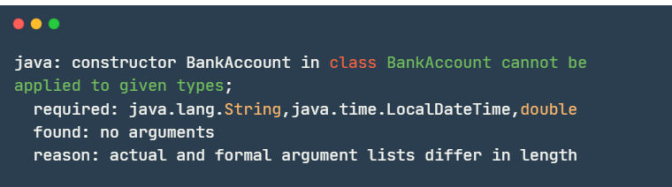

### Введение

Конструкторы в Java представляют собой специальный блок кода, похожий на метод, предназначенный для инициализации полей
объектов при его создании. Он вызывается всегда, когда создается новый экземпляр класса.

Существуют три базовых типа конструкторов в Java:
• конструктор по умолчанию (default constructor)
• конструктор без аргументов (no-args constructor)
• параметризованный конструктор (parameterized constructor)

**Основные правила работы с конструкторами в Java:**

* Конструктор имеет то же имя, что и класс, в котором он находится
* Конструктор не имеет возвращаемого значения, даже типа void.
* Конструктор вызывается автоматически при создании объекта класса через оператор new.
* Конструктор может принимать параметры, которые позволяют передавать данные для инициализации объекта.
* Если конструктор не определен в классе, то компилятор автоматически добавит конструктор по умолчанию без параметров.
* Конструктор может вызывать другой конструктор из этого же класса через this().
* Конструктор может быть перегружен, т.е. в классе может быть несколько конструкторов с разными списками параметров.
* Конструктор можно пометить модификатором доступа (public, private и т.д.) для управления видимостью.

### 1. Конструктор по умолчанию

Создадим простой класс, описывающий банковский счет. Он будет содержать следующие поля: name («имя»), opened («дата
создания») и balance («баланс»). Для удобства вывода значений полей на консоль также переопределим метод toString():

```java
import java.time.LocalDateTime;

public class BankAccount {
    String name;
    LocalDateTime opened;
    double balance;

    @Override
    public String toString() {
        return String.format("Имя: %s \nДата создания: %s \nБаланс: %f",
                name, opened.toString(), balance);
    }
}
```

Теперь BankAccount содержит все нужные поля для хранения информации о банковском счете (вы можете сделать их private, а
также добавить геттеры и сеттеры. Мы опустили этот код, оставив только необходимое), а также невидимый конструктор,
который называется конструктором по умолчанию (default constructor). Данный конструктор создается автоматически
компилятором.
Если попробовать создать экземпляр класса BankAccount, то его поля будут проинициализированы не подходящими нам
значениями, а значениями по умолчанию:

```java
public class Main {
    public static void main(String[] args) {
        BankAccount account = new BankAccount();
        System.out.println(account);
    }
}
```

Запуск этого класса приведет к выкидыванию исключения NullPointerException из-за вызова метода toString() у переменной
opened, т.к. она имела значение null (вызов toString() делается автоматически при передаче имени объекта в println.
Вызывать его явно не обязательно).
Давайте посмотрим на вывод стектрейса в консоль в разных версиях Java.
Так будет выглядеть стектрейс после запуска кода с использованием Java 11:



А это вывод уже с Java 15:



Как видно, информативность вывода стектрейса в разных версиях Java отличается. Начиная с Java 15 по умолчанию
используется так называемый Helpful NullPointerException, который позволяет получить более детальный отчет о причине
сгенерированного исключения с указанием переменной, которая его вызвала.

### 2. Конструктор без аргументов

Исправим NPE, добавив в класс конструктор. В этом случае код для BankAccount будет следующим:

```java
import java.time.LocalDateTime;

class BankAccount {
    String name;
    LocalDateTime opened;
    double balance;

    public BankAccount() {
        name = "";
        opened = LocalDateTime.now();
        balance = 0.0d;
    }

    @Override
    public String toString() {
        return String.format("Имя: %s \nДата создания: %s \nБаланс: %f",
                name, opened.toString(), balance);
    }
}
```


С точки зрения используемой памяти, статические переменные размещаются в специальном пуле в памяти JVM, называемом
Metaspace (до Java 8 он назывался Permanent Generation или PermGen, который был полностью удален и заменен на
Metaspace).

### 2.1 Анатомия конструктора

Хотя у конструктора и не указывается возвращаемый тип, но он все же неявно возвращает тип создаваемого объекта. В
спецификации языка Java указано:  «Непосредственно перед тем, как будет возвращен результат в виде ссылки на только что
созданный объект, указанный конструктор будет использован для
инициализации этого нового объекта.» Таким образом, вызов new BankAccount() вызывает созданный нами конструктор без
аргументов и неявно возвращает результат в виде ссылки на только что созданный объект.

Тут главное не путаться в терминологии: конструктор по умолчанию создает компилятор, если программист не создал свой;
конструктор без аргументов (no-argument constructor) создает программист, а по умолчанию уже не создается. Оба
конструктора не принимают аргументы, но при этом называются по-разному.
А теперь давайте подробно разберем, что происходит в следующей строке:

```java
BankAccount account = new BankAccount();
```

Объявляется переменная account типа BankAccount. Она необходима для хранения ссылки на создаваемый объект (чтобы можно
было к нему обращаться, например, для вызова какого-то метода). Далее создается сам объект. Происходит это при помощи
оператора new, который динамически выделяет для него память в куче (heap) и возвращает на него ссылку. Эта ссылка
присваивается переменной account.

Имя класса, идущее после оператора new, указывает на имя его конструктора, который определяет, что происходит при
создании объекта (это может быть инициализация полей, вызов других конструкторов и т.д.).

### 3. Параметризованный конструктор

Итак, чтобы сделать что-то действительно полезное с нашим банковским счетом, необходимо иметь возможность передавать
нужные нам начальные значения в объект.
Для этого давайте напишем еще один конструктор в файл BankAccount.java, который будет принимать аргументы. Такой
конструктор называется — параметризованный конструктор (parameterized constructor):

```java
import java.time.LocalDateTime;

class BankAccount {
    String name;
    LocalDateTime opened;
    double balance;

    public BankAccount() {
        name = "";
        opened = LocalDateTime.now();
        balance = 0.0d;
    }

    public BankAccount(String name, LocalDateTime opened, double balance) {
        this.name = name;
        this.opened = opened;
        this.balance = balance;
    }

    @Override
    public String toString() {
        return String.format("Имя: %s \nДата создания: %s \nБаланс: %f",
                name, opened.toString(), balance);
    }
}
```

Также внесем изменения в файл Main.java:

```java
import java.time.LocalDateTime;
import java.time.Month;

public class Main {
    public static void main(String[] args) {
        LocalDateTime opened = LocalDateTime.of(1986, Month.MAY, 30, 4, 30, 0);
        BankAccount account = new BankAccount("Tom", opened, 12_642.0f);

        System.out.println(account);
    }
}
```

Запустим программу:


Теперь у класса BankAccount два конструктора: без аргументов и параметризованный. При этом вызываться будет тот
конструктор, который мы укажем при создании объекта.

### 3.1 Ключевые моменты

Обратим внимание на особенности конструктора:

* Конструктор вызывается каждый раз при создании объекта
* Имя конструктора должно совпадать с именем класса
* Конструктор не может иметь возвращаемый тип (даже void)
* К конструктору можно применять модификаторы доступа для контроля его вызова
* Конструкторы в классе размещаются строго в определенном месте:

Обратите внимание на способ и порядок размещения конструкторов: они располагаются сразу после полей в порядке, зависящем
от принимаемых ими числа аргументов — от меньшего к большему.

* Конструктор может принимать в качестве аргумента как примитивные типы данных, так и объекты
* Класс может содержать любое количество конструкторов

Мы можем создать столько конструкторов, сколько захотим, но, вероятно, не хотелось бы создавать их слишком много. Это
может усложнить и загромоздить код. Конструкторы нужно создавать по мере необходимости. При большом количестве
конструкторов для упрощения кода можно использовать Шаблоны проектирования из категории Creational Design Patterns.

* Компилятор не сгенерирует конструктор по умолчанию, если программист реализовал свой конструктор:

```java
import java.time.LocalDateTime;

public class BankAccount {
    String name;
    LocalDateTime opened;
    double balance;

    BankAccount(String name, LocalDateTime opened, double balance) {
        this.name = name;
        this.opened = opened;
        this.balance = balance;
    }
}
```

Попробуем создать экземпляр класса BankAccount:

```java
public class Main {
    public static void main(String[] args) {
        BankAccount bankAccount = new BankAccount();
    }
}
```

Компилятор выведет ошибку, поскольку он не сможет найти конструктор без аргументов (не по умолчанию!):



###                                  * Конструктор копирования

Конструктором копирования (copy constructor) называется специальный конструктор, который принимает в качестве аргумента
экземпляр того же класса для создания нового объекта на основе переданного.
Такие конструкторы применяются тогда, когда необходимо создать копию сложного объекта, но при этом мы не хотим
использовать метод clone().
Представьте, что нам нужно создать новую учетную запись из существующей, которая должна иметь то же имя, что и старая,
но сегодняшнюю дату создания и отсутствие средств. Мы можем сделать это с помощью конструктора копирования, добавив его
в файл BankAccount.java:

```java
import java.time.LocalDateTime;

class BankAccount {
    String name;
    LocalDateTime opened;
    double balance;

    public BankAccount(BankAccount account) {
        name = account.name;
        opened = LocalDateTime.now();
        balance = 0.0f;
    }

    public BankAccount(String name, LocalDateTime opened, double balance) {
        this.name = name;
        this.opened = opened;
        this.balance = balance;
    }

    @Override
    public String toString() {
        return String.format("Имя: %s \nДата создания: %s \nБаланс: %f ",
                name, opened.toString(), balance);
    }
}
```

Внесем изменения в файл Main.java:

```java
import java.time.LocalDateTime;
import java.time.Month;

public class Main {
    public static void main(String[] args) {
        LocalDateTime opened = LocalDateTime.of(1986, Month.MAY, 30, 4, 30, 0);
        BankAccount account = new BankAccount("Tom", opened, 12_642.0f);
        BankAccount newAccount = new BankAccount(account);

        System.out.println("Имя владельца для счета account = " + account.name);
        System.out.println("Имя владельца для счета newAccount = " + newAccount.name);
        System.out.println("\nРезультат выполнения кода после изменения имени владельца счета \n");

        newAccount.name = "Thomas";

        System.out.println("Имя владельца для счета account = " + account.name);
        System.out.println("Имя владельца для счета newAccount = " + newAccount.name);
    }
}
```

Запустим программу:



Обратите внимание, ссылка на имя в конструкторе копирования копируется в значение name нового объекта. Т. е. значение
нового объекта будет ссылаться на один и тот же адрес в памяти, что и оригинальный объект. Поскольку переменная String
являеся immutable, она никогда не изменится. Чтобы изменить ее значение, ей нужно будет присвоить другую ссылку. При
этом name других объектов будут по прежнему ссылаться на прежнее место в памяти (класс LocalDateTime также является
immutable, и все сказанное выше справедливо и для него). Результат выполнения кода подтверждает, что заменив ссылку
переменной name порожденного объекта, значение ссылки оригинального объекта осталось прежним.

### 4.1 Поверхностное копирование

Что произойдет, если переменная объекта будет ссылаться на изменяемую (mutable) переменную? Рассмотрим механизм так
называемого «поверхностного копирования» (shallow copy). Такой механизм характеризуется копированием ссылок
оригинального объекта в создаваемый объект.
Создадим новый класс Customer и перенесем в него имя владельца счета из BankAccount. Этот пример должен показать, что
при поверхностном копировании копируются ссылки на значения из оригинального объекта. При этом, если копируемая ссылка
принадлежит mutable-объекту, то при ее изменении в любом объекте (не важно, в новом или исходном) ее значение изменится
во всех других объектах.

```java
public class Customer {
    String name;

    public Customer(String name) {
        this.name = name;
    }
}
```

```java
import java.time.LocalDateTime;

class BankAccount {
    Customer customer;
    LocalDateTime opened;
    double balance;

    public BankAccount(BankAccount account) {
        customer = account.customer;
        opened = LocalDateTime.now();
        balance = 0.0f;
    }

    public BankAccount(Customer customer, LocalDateTime opened, double balance) {
        this.customer = customer;
        this.opened = opened;
        this.balance = balance;
    }

    @Override
    public String toString() {
        return String.format("Имя: %s \nДата создания: %s \nБаланс: %f ",
                customer.name, opened.toString(), balance);
    }
}
```

Также, внесем изменения в файл Main. java:

```java
import java.time.LocalDateTime;
import java.time.Month;

public class Main {
    public static void main(String[] args) {
        LocalDateTime opened = LocalDateTime.of(1986, Month.MAY, 30, 4, 30, 0);
        BankAccount account = new BankAccount(new Customer("Tom"), opened, 12_642.0f);
        BankAccount newAccount = new BankAccount(account);

        System.out.println("Имя владельца для счета account = " + account.customer.name);
        System.out.println("Имя владельца для счета newAccount = " + newAccount.customer.name);

        System.out.println("\nРезультат выполнения кода после изменения имени владельца счета newAccount:\n");

        newAccount.customer.name = "Thomas";

        System.out.println("Имя владельца для счета account = " + account.customer.name);
        System.out.println("Имя владельца для счета newAccount = " + newAccount.customer.name);

        System.out.println("\nРезультат выполнения кода после изменения имени владельца счета account:\n");

        account.customer.name = "Max";

        System.out.println("Имя владельца для счета account = " + account.customer.name);
        System.out.println("Имя владельца для счета newAccount = " + newAccount.customer.name);

    }
}
```

Запустим программу:



Как видно из результата, изменения затрагивают все объекты, что не всегда бывает полезно.

### 4.2 Глубокое копирование

Если результат работы поверхностного копирования вас не удовлетворяет, то можно воспользоваться глубоким копированием (
deep copy). Этот вид копирования позволяет создавать объекты, которые будут содержать точные копии всех полей (в том
числе ссылочных) оригинального объекта, но при этом будут абсолютно независимы от оригинального объекта.
Рассмотрим пример:

```java
import java.time.LocalDateTime;

class BankAccount {
    Customer customer;
    LocalDateTime opened;
    double balance;

    public BankAccount(BankAccount account) {
        customer = new Customer(account.customer.name);
        opened = LocalDateTime.now();
        balance = 0.0f;
    }

    public BankAccount(Customer customer, LocalDateTime opened, double balance) {
        this.customer = customer;
        this.opened = opened;
        this.balance = balance;
    }

    @Override
    public String toString() {
        return String.format("Имя: %s \nДата создания: %s \nБаланс: %f ",
                customer.name, opened.toString(), balance);
    }
}
```

Также, внесем изменения в файл Main. java:

```java
import java.time.LocalDateTime;
import java.time.Month;

public class Main {
    public static void main(String[] args) {
        LocalDateTime opened = LocalDateTime.of(1986, Month.MAY, 30, 4, 30, 0);
        BankAccount account = new BankAccount(new Customer("Tom"), opened, 12_642.0f);
        BankAccount newAccount = new BankAccount(account);

        System.out.println("Имя владельца для счета account = " + account.customer.name);
        System.out.println("Имя владельца для счета newAccount = " + newAccount.customer.name);

        System.out.println("\nРезультат выполнения кода после изменения имени владельца счета newAccount:\n");

        newAccount.customer.name = "Thomas";

        System.out.println("Имя владельца для счета account = " + account.customer.name);
        System.out.println("Имя владельца для счета newAccount = " + newAccount.customer.name);

        System.out.println("\nРезультат выполнения кода после изменения имени владельца счета account:\n");

        account.customer.name = "Max";

        System.out.println("Имя владельца для счета account = " + account.customer.name);
        System.out.println("Имя владельца для счета newAccount = " + newAccount.customer.name);
    }
}
```

Запустим программу:


Как видно по результату, изменение полей скопированного (склонированного) объекта не отразилось на изменении полей
оригинального объекта (справедливо и для обратного случая).

### 4.3 Ключевые моменты

* Значение примитивов (int, float, double и т. д.) копируются как есть
* Ссылки на объекты типа immutable (например String), также копируются как есть. Несмотря на то, что оригинальный и
  порожденный объекты ссылаются на тот же самый адрес в памяти, immutable-объекты никогда не будут изменяться
* Ссылки на mutable объекты (например Date, List и т. д.) должны копироваться при помощи глубокого копирования. Иначе
  оригинальный и порожденный объекты будут ссылаться на один и тот же адрес в памяти и соответственно, любые изменения
  объекта (оригинального или порожденного) будут отображаться на всех объектах

### 5. Связанные конструкторы

Hужно отметить, что мы не обязаны в конструктор передавать для инициализации всех полей класса какие-то значения. Часть
обязанностей можно возложить на компилятор, который присвоит полям значения по умолчанию (если это не критично). Также,
в процессе работы программы, можно использовать сеттеры.
Для демонстрации этой возможности давайте создадим новый банковский счет, введя только имя. Для этого создадим
конструктор с параметром имени, а другим параметрам дадим значения по умолчанию. Затем все эти аргументы передадим из
одного конструктора в другой, используя this():

```java
import java.time.LocalDateTime;

class BankAccount {
    String name;
    LocalDateTime opened;
    double balance;

    public BankAccount() {
        this("", LocalDateTime.now(), 0.0d);
    }

    public BankAccount(BankAccount account) {
        this(account.name, LocalDateTime.now(), 0.0f);
    }

    public BankAccount(String name) {
        this(name, LocalDateTime.now(), 0.0f);
    }

    public BankAccount(String name, LocalDateTime opened, double balance) {
        this.name = name;
        this.opened = opened;
        this.balance = balance;
    }

    @Override
    public String toString() {
        return String.format("Имя: %s \nДата создания: %s \nБаланс: %f",
                name, opened.toString(), balance);
    }
}
```

Файл Main.java перепишем в следующем виде:

```java
public class Main {
    public static void main(String[] args) {
        BankAccount account = new BankAccount("Tom");
        System.out.println(account);
    }
}
```

Запустим программу:


Как вы могли заметить, в теле конструктора используется ключевое слово this с круглыми скобками, которое позволяет
вызывать другой конструктор, передавая в него аргументы (не любой, а только тот, который подходит по количеству и типам
передаваемых аргументов). Это нормальная практика вызывать конструкторы по цепочке (в рамках текущего класса), когда
часть значений используется по умолчанию, а какие-то являются новыми.
Но бывает и другая ситуация, когда мы хотим перед отработкой конструктора потомка вызвать конструктор суперкласса. В
таком случае нужно использовать ключевое слово super().
Создадим класс VipBankAccount, сделав его наследником BankAccount:

```java
import java.time.LocalDateTime;

public class VipBankAccount extends BankAccount {
    String status;

    public VipBankAccount(String name, String status) {
        super(name, LocalDateTime.now(), 0.0f);
        this.status = status;
    }

    @Override
    public String toString() {
        return String.format("Имя: %s \nДата создания: %s \nБаланс: %f \nСтатус: %s",
                name, opened.toString(), balance, status);
    }
}
```

Перепишем Main. java:

```java
public class Main {
    public static void main(String[] args) {
        VipBankAccount vipAccount = new VipBankAccount("Thomas", "VIP");
        System.out.println(vipAccount);
    }
}
```


### 6. Объект-значение

Интересное использование конструкторов в Java — создание объектов-значений (Value Objects). Value Object — это объект,
который не меняет своего внутреннего состояния после инициализации (становится immutable). Это значит, что если
требуется изменить такой объект, то для этого придется создать его новый экземпляр, вместо того чтобы изменять
существующий.
Давайте создадим неизменяемый класс Transaction, представляющий собой транзакцию некоторого количества денежных средств
с конкретного счета, с фиксацией даты и времени проведения транзакции:

```java
import java.time.LocalDateTime;

public class Transaction {
    final BankAccount bankAccount;
    final LocalDateTime date;
    final double amount;

    /* 
       Код ниже приведет к ошибке компиляции, если переменная amount будет final
      
       public Transaction(BankAccount account, LocalDateTime date) {
           this.bankAccount = account;
           this.date = date;
       }
    */
    public Transaction(BankAccount account, LocalDateTime date, double amount) {
        this.bankAccount = account;
        this.date = date;
        this.amount = amount;
    }

    @Override
    public String toString() {
        return String.format("Проведена транзакция на сумму - %s, \n\nС банковского счета 17:             - %s. \n\nДата и время транзакции: %s", amount, bankAccount, date.toString());
    }
}
```

Обратите внимание, что теперь мы используем ключевое слово final при определении членов класса. Это означает, что каждый
из них может быть инициализирован только с помощью конструктора. Их нельзя переназначить позже в каком-либо другом
методе. Мы можем считать эти значения, но не можем их изменить.
Если мы создадим несколько конструкторов для класса Transaction, то каждый из них должен будет инициализировать каждую
финальную переменную. Невыполнение этого приведет к ошибке компиляции. Например, если раскомментировать конструктор в
коде класса Transaction, то на этапе компиляции мы получим ошибку с сообщением «java: variable amount might not have
been initialized».
Перепишем файл Main. java в следующем виде:

```java
import java.time.LocalDateTime;

public class Main {
    public static void main(String[] args) {
        LocalDateTime actionDate = LocalDateTime.now();
        BankAccount account = new BankAccount("Tom");
        Transaction transaction = new Transaction(account, actionDate, 1234);

        System.out.println(transaction);
    }
}
```



### 7. Дополнительные ключевые моменты

* Конструктор не может быть объявлен как final, static, synchronized или abstract
* Конструктор может быть перегружен (overload)

Перегрузка конструктора означает, что какой-либо класс может иметь множество конструкторов, но при этом их списки
параметров должны отличаться между собой.

Например:

```java
import java.time.LocalDateTime;

public class BankAccount {
    String name;
    LocalDateTime opened;
    double balance;

    BankAccount() {
        name = "";
        opened = LocalDateTime.now();
        balance = 0.0d;
    }

    BankAccount(String name) {
        this.name = name;
    }

    BankAccount(String name, LocalDateTime opened) {
        this.name = name;
        this.opened = opened;
    }

    BankAccount(String name, LocalDateTime opened, double balance) {
        this.name = name;
        this.opened = opened;
        this.balance = balance;
    }
}
```

Класс BankAccount имеет 4 различных конструктора, следовательно мы можем создать объект BankAccount четырьмя различными
способами:

```java
import java.time.LocalDateTime;

public class Main {
    public static void main(String[] args) {
        LocalDateTime actionDate = LocalDateTime.now();

        BankAccount bankAccount1 = new BankAccount();
        BankAccount bankAccount2 = new BankAccount("Tom");
        BankAccount bankAccount3 = new BankAccount("Tom", actionDate);
        BankAccount bankAccount4 = new BankAccount("Tom", actionDate, 0.0);
    }
}
```

* Конструкторы не наследуются подобно методам суперкласса

```java
import java.time.LocalDateTime;

public class BankAccount {
    String name;
    LocalDateTime opened;
    double balance;

    BankAccount(String name, LocalDateTime opened, double balance) {
        this.name = name;
        this.opened = opened;
        this.balance = balance;
    }
}

class VipBankAccount extends BankAccount {
}
```

Мы не сможем сделать что-то вроде этого:

```java
import java.time.LocalDateTime;

public class Main {
    public static void main(String[] args) {
        LocalDateTime actionDate = LocalDateTime.now();
        VipBankAccount vipBankAccount = new VipBankAccount("Tom", actionDate, 0.0);
    }
}
```

Компилятор выдаст ошибку:



Компилятор будет искать в VipBankAccount конструктор, который принимает три аргумента, но кроме конструктора по
умолчанию (об этом сообщается в тексте ошибки «required: no arguments»), ничего не находит.
Чтобы код запускался без ошибок, необходимо переписать класс VipBankAccount в следующем виде:

```java
import java.time.LocalDateTime;

public class VipBankAccount extends BankAccount {
    VipBankAccount(String name, LocalDateTime opened, double balance) {
        super(name, opened, balance);
    }
}
```

* Конструкторы могут иметь модификатор доступа private

Мы можем сделать конструктор приватным (private), что не позволит создавать его экземпляры. Какой в этом смысл?
Например, в паттерне проектирования Одиночка (Singleton) приватный конструктор используется для контроля над количеством
создаваемых экземпляров. Всегда можно будет создать только один объект.
Рассмотрим следующий пример:

```java
import java.time.LocalDateTime;

public class BankAccount {
    private static BankAccount instance;

    String name;
    LocalDateTime opened = LocalDateTime.now();
    double balance = 0.0f;

    private BankAccount(String name) {
        this.name = name;
    }

    public static BankAccount getInstance(String name) {
        if (instance == null) {
            instance = new BankAccount(name);
        }
        return instance;
    }

    @Override
    public String toString() {
        return String.format("Имя: %s \nДата создания: %s \nБаланс: %f\n", name, opened.toString(), balance);
    }
}
```

```java
public class Main {
    public static void main(String[] args) {
        BankAccount bankAccount1 = BankAccount.getInstance("Tom");
        BankAccount bankAccount2 = BankAccount.getInstance("Elena");

        System.out.println(bankAccount1);
        System.out.println(bankAccount2);
    }
}
```

Класс BankAccount (реализует упрощенный паттерн одиночка) предоставляет статический метод getInstance(), который
проверяет создан ли уже экземпляр класса или нет. Если создан, то новый не создается, а возвращается ссылка на
существующий.


Результат выполнения программы подтверждает, что в программе создается только один объект.
Иногда класс может быть служебным и хранить какие-то статические поля и статические методы. Необходимости в создании
экземпляров таких классов нет, поэтому и в конструкторе нет смысла, но как мы уже знаем, компилятор создаст конструктор
по умолчанию. Чтобы этого не произошло, мы можем сами создать пустой конструктор и сделать его закрытым, используя
модификатор доступа private. Такой конструктор называется закрытый.
Пример такого служебного класса:

```java
public class BankAccountUtils {
    private BankAccountUtils() {
    }

    public static String namesConcatenate(String name, String surname) {
        return name + " " + surname;
    }
}
```

Метод namesConcatinate объединяет имя и фамилию в одну строковую переменную. Закрытый конструктор BankAcoountUtils()
делает невозможным создание экземпляра класса BankAccountUtils. Следующий код выведет объединенную строковую переменную
без создания объекта:

```java
public class Main {
    public static void main(String[] args) {
        System.out.println(BankAccountUtils.namesConcatenate("Tom", "Jeferson"));
    }
}
```


* Конструктор по умолчанию имеет тот же самый модификатор доступа, что и класс

Если мы определим класс следующим образом:

```java
public class BankAccount {
}
```

то компилятор вставит конструктор по умолчанию с таким же самым модификатором доступа:

```java
public BankAccount() {
}
```

* Конструктор класса вызывает конструктор по умолчанию его суперкласса (по цепочке вплоть до Object)

Компилятор Java автоматически вставляет неявно вызов super () в первую строку любого конструктора. Рассмотрим следующие
два класса:

```java
import java.time.LocalDateTime;

public class BankAccount {
    String name;
    LocalDateTime opened;
    double balance;

    public BankAccount(String name, LocalDateTime opened, double balance) {
        this.name = name;
        this.opened = opened;
        this.balance = balance;
    }
}

public class VipBankAccount extends BankAccount {
    VipBankAccount() {
    }
}
```

Такой код не скомпилируется, поскольку компилятор вставляет вызов super() в конструктор VipBankAccount:

```java
VipBankAccount() {
    super();    // метод вставлен компилятором автоматически
}
```

Но в классе BankAccount отсутствует конструктор по умолчанию (или пустой конструктор), поэтому компилятор сгенерирует
ошибку компиляции следующего вида:



Поэтому, обращайте внимание на это правило при наследовании родительского класса.

* Первым выражением в конструкторе должен быть вызов метода this () или super()
* Конструктор и сеттеры можно (нужно) использовать совместно:

Если используется конструктор по умолчанию, то далее предполагается, что при помощи сеттеров (setter) полям объекта
присваиваются нужные нам значения, которые на момент его создания были неизвестны.
В случае же с параметризованным конструктором, значения полей сразу инициализируются подходящими нам значениями. Один
вызов такого конструктора заменяет собой вызов нескольких сеттеров. При этом создается объект с корректными значениями
полей. Кроме того, параметризованный конструктор позволяет создать неизменяемый объект (immutable — это объект,
состояние которого не может быть изменено после создания), что невозможно при использовании сеттеров.
Также, возможны комбинации, когда объект создается с несколькими обязательными полями, и с полями, инициализированными
значениями по умолчанию, которые в дальнейшем могут неоднократно изменяться сеттерами.
