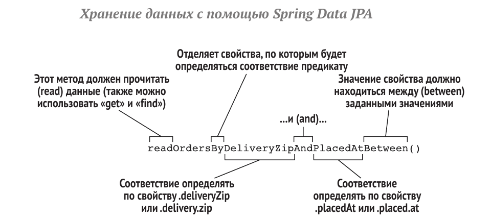

### Что такое Spring Data JPA?

**Spring Data JPA** - это модуль Spring Framework, предназначенный для упрощения работы с данными в приложениях Java,
использующих **JPA (Java Persistence API)**.
Основные возможности Spring Data JPA:

* Автоматическое создание репозиториев на основе интерфейсов для доступа к данным. Реализация CRUD методов генерируется
  автоматически.
* Поддержка JPQL запросов, создание запросов на основе методов репозитория.
* Автоматическая пагинация и сортировка.
* Простая настройка и интеграция с Spring Boot.
* Удобные средства для тестирования репозиториев и компонентов доступа к данным.
* Возможность расширения и настройки генерируемых запросов.

Таким образом, Spring Data JPA позволяет минимизировать рутинный код для доступа к данным и сосредоточиться на
бизнес-логике приложения. Это один из ключевых модулей при разработке приложений Spring на основе JPA.

### Когда его использовать?

Использование Spring Data JPA рекомендуется в следующих случаях:

* При разработке приложений на Spring, где в качестве ORM используется JPA. Spring Data JPA упростит работу с данными.
* Если нужен быстрый доступ к реляционным данным (через JPA реализации - Hibernate, EclipseLink и др.).
* Для автоматизации рутинных операций CRUD, пагинации и сортировки данных.
* При необходимости тесной интеграции с другими модулями экосистемы Spring.
* Для упрощения тестирования кода, работающего с данными.
* Если требуется гибкая настройка и расширение запросов к данным.
* При разработке web-приложений и микросервисов с использованием Spring Boot.
* Для быстрого прототипирования приложений и уменьшения объема рутинного кода.

### Как он работает под капотом ?

**Реализация шаблона "репозиторий" в Spring Data JPA**

Spring Data JPA поддерживает шаблон репозитория, который является ключевым в **Domain-Driven Design (DDD).** Это
позволяет
создать чёткое разделение слоя данных, делая код более сжатым и управляемым. Интерфейсы репозиториев предоставляют
операции CRUD, освобождая разработчиков для работы над бизнес-логикой.

**Усовершенствованная система именования методов для запросов**

Важной особенностью Spring Data JPA является создание запросов на основе наименований методов. Это позволяет экономить
время и обеспечивает типобезопасный доступ к данным без дублирования SQL или JPQL кода. Для сложных запросов Spring Data
поддерживает использование Querydsl и позволяет определять запросы на JPQL и SQL с помощью аннотации @Query.

**Динамическая обработка данных: пагинация и сортировка**

Spring Data JPA эффективно обрабатывает большие объемы данных благодаря поддержке пагинации и сортировки. Это делает
приложения более отзывчивыми и производительными.

