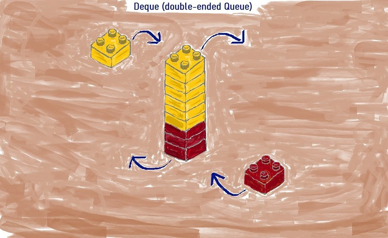
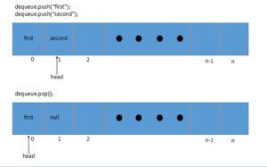

### **Что такое коллекции**

Коллекции — это наборы однородных элементов. Например, страницы в книге, яблоки в корзине или люди в очереди.

Инструменты для работы с такими структурами в Java содержатся в **Java Collections Framework**. Фреймворк состоит из
интерфейсов, их реализаций и утилитарных классов для работы со списками: сортировки, поиска, преобразования.


На схеме видно, что существует два основных интерфейса, от которых реализуются остальные классы и интерфейсы коллекций.

1. **Collection** – обычная коллекция, которая содержит набор отдельных элементов (объектов). В этой коллекции есть
   основные
   методы для работы с элементами: вставка (**add**, **addAll**), удаление (**remove**, **removeAll**, **clear**),
   поиск (**contains**,
   **containsAll**), проверка на пустоту коллекции (**isEmpty**) и размер (**size**).

2. **Map** — коллекция, структура которой представляет собой пары "ключ — значение". Причем в рамках одной Map каждый
   ключ
   уникален: нет двух одинаковых по значению ключей. Также эту коллекцию иногда называют словарем (dictionary). **Map
   ** —
   это отдельный интерфейс. Он не реализует интерфейс **Collection**, но входит в Java Collections Framework.

### Начнем с интерфейса Collection

Интерфейс Collection расширяет интерфейс **Iterable**, а у этого интерфейса есть единственный метод **iterator()**. Для
нас это
означает, что любая коллекция, которая наследуется от Iterable, будет уметь возвращать итератор.

**Iterator** используется для перебора элементов коллекции. Итератор предоставляет для этого три метода:

* **E next();** – Позволяет получить следующий элемент коллекции.
* **boolean hasNext();** – Возвращает true, если следующий элемент есть.
* **void remove();** – Удаляет текущий элемент.

Эти интерфейсы позволяют объектам быть целевыми для оператора "**for-each**", что упрощает итерацию по коллекциям.

```java
final List<String> names = List.of("mark", "mike", "kate");
for(
String name :names){ // цикл for-each
        System.out.

println(name);
}
```

Интерфейс **Collection** является основным интерфейсом для всех типов коллекций в Java и расширяет интерфейс Iterable.
Он
предоставляет широкий набор методов для управления элементами коллекции, включая операции добавления, удаления, поиска и
получения информации о коллекции.

1. **boolean add(E e)**: Добавляет элемент в коллекцию. Возвращает true, если коллекция изменилась после вызова метода.
2. **boolean addAll(Collection<? extends E> c)**: Добавляет все элементы из указанной коллекции в данную коллекцию.
   Возвращает true, если коллекция изменилась после вызова метода.
3. **void clear()**: Удаляет все элементы из коллекции.
4. **boolean contains(Object o)**: Возвращает true, если коллекция содержит указанный элемент.
5. **boolean containsAll(Collection<?> c)**: Возвращает true, если коллекция содержит все элементы указанной коллекции.
6. **boolean equals(Object o)**: Сравнивает указанный объект с текущей коллекцией на равенство.
7. **int hashCode()**: Возвращает хеш-код для коллекции.
8. **boolean isEmpty()**: Возвращает true, если коллекция не содержит элементов.
9. **Iterator<E> iterator()**: Возвращает итератор для перебора элементов коллекции.
10. **boolean remove(Object o)**: Удаляет указанный элемент из коллекции. Возвращает true, если коллекция содержала
    элемент
    перед удалением.
11. **boolean removeAll(Collection<?> c)**: Удаляет из коллекции все элементы, которые содержатся в указанной коллекции.
    Возвращает true, если коллекция изменилась после вызова метода.
12. **boolean retainAll(Collection<?> c)**: Удаляет из коллекции все элементы, которые не содержатся в указанной
    коллекции.
    Возвращает true, если коллекция изменилась после вызова метода.
13. **int size()**: Возвращает количество элементов в коллекции.
14. **Object[] toArray()**: Возвращает массив, содержащий все элементы коллекции.
15. **<T> T[] toArray(T[] a)**: Возвращает массив, содержащий все элементы коллекции, при этом тип массива определяется
    указанным массивом 'a'.

**Кроме того, в Java 8 были добавлены дополнительные методы для работы с коллекциями, такие как методы для стримов,
фильтрации, сортировки и преобразования элементов. Некоторые из них включают stream(), parallelStream(), removeIf(
Predicate<? super E> filter), forEach(Consumer<? super E> action) и другие.**

### Интерфейс List

Интерфейс **List** в Java Collection Framework представляет упорядоченную коллекцию (также известную как
последовательность). Интерфейс **List** расширяет **Collection** и предоставляет широкий спектр методов для манипуляций
с
элементами коллекции.

Используется для создания простых списков:

* Сохраняет последовательность элементов

* Элементы могут быть доступны по индексу

* Может содержать повторяющиеся элементы

```java
public interface List<E> extends Collection<E>
```

Помимо **Iterator** списки также могут вернуть **Listerator**, который позволяет вставку и замену элементов, а также
двунаправленный доступ.

Рассмотрим основные методы, предоставляемые интерфейсом **List**:

1. **void add(int index, object obj)** – вставляет элемент obj в позицию index. Старые элементы, начиная с позиции
   index, сдвигаются, их индексы увеличиваются на единицу.
2. **boolean addAll(int index, Collection coll)** – вставляет все элементы коллекции coll
3. **object get(int index)** – Этот метод используется для получения элемента из списка по указанному индексу.
4. **int indexOf(Object obj)** – Возвращает индекс первого вхождения указанного элемента в этом списке или -1, если этот
   список не содержит элемента.
5. **int lastindexOf(object obj)** – Возвращает индекс последнего вхождения указанного элемента в этом списке или -1,
   если этот список не содержит элемента.
6. **Object set(int index, object obj)** – Используется для замены элемента в этом списке на указанной позиции на
   указанный элемент.
7. **List subList(int from, int to)** – возвращает часть коллекции от позиции from включительно до позиции to
   исключительно.

Это основные методы, которые предоставляет интерфейс List, и которые могут быть использованы для выполнения операций
над списками, таких как добавление, удаление, получение и замена элементов.

### Класс ArrayList

**ArrayList** в Java — это динамический массив, который хранит свои элементы в массиве. Размер этого массива (емкость
**ArrayList**) автоматически увеличивается, когда мы добавляем больше элементов, чем он может вместить. Внутри, *
*ArrayList**
использует массив объектов (**Object[]**) для хранения элементов.

_Стоит так же упомянуть, что до появления Java Collection Framework существовал класс Vector, который в последствии был
включен в Java Collection. В отличии от всех реализаций колекции, Vector синхронизирован. Если потокобезопасная
реализация не требуется, рекомендуется использовать ArrayList вместо Vector._

Каждый экземпляр **ArrayList** имеет емкость (**CAPACITY**). Емкость – это размер массива, который используется для
хранения
элементов. По мере добавления элементов в **ArrayList** его емкость автоматически увеличивается. Начальный размер
capacity
равен 10. Вы можете передать свое значение capacity используя конструктор **public ArrayList(int initialCapacity)**.


Когда элементы добавляются в **ArrayList** и его емкость становится недостаточной, его емкость увеличивается. Новая
емкость
рассчитывается как **старая емкость * 1.5 + 1**. То есть, если у нас было место для 10 элементов, теперь будет 16.
Внутренний массив создается заново с новой емкостью и старые элементы копируются в новый массив. **Это довольно
затратная
операция, поэтому если изначально известно, что **ArrayList** будет хранить много элементов, рекомендуется задавать
достаточно большую начальную емкость.**

Удаление элементов из **ArrayList** также может быть затратной операцией, особенно если удаляется элемент из середины
списка. При удалении элемента, все элементы, следующие за ним, сдвигаются на одну позицию назад, что требует копирования
данных.

При этом размер внутреннего массива автоматически не уменьшается, поэтому если из массива часто удаляются элементы, и
при этом не добавляется новых, имеет смысл использовать метод **trimToSize**();. Этот метод есть только у ArrayList и
отсутсвует у List.

ArrayList не синхронизирован, то есть не является потокобезопасным. Если несколько потоков изменяют ArrayList
одновременно, его состояние может стать непредсказуемым.

Выводы:

* Использует внутри простой массив;
* Автоматически увеличивается, **но не уменьшается**;
* **Не синхронизирован**;
* Быстрый доступ к элементам по индексу за время O(1);
* Быстрая вставка и удаление элементов с конца за константное время O(1)
* Доступ к элементам по значению за линейное время O(n);
* **Медленная вставка и удаление элементов из середины**
* Позволяет хранить любые значения в том числе и null;

```java
public class ArrayList<E>
        extends AbstractList<E>
        implements List<E>, RandomAccess, Cloneable, Serializable
```

**Конструкторы ArrayList:**

```java
ArrayList();

ArrayList(100);                             // задаем емкость capacity

ArrayList<>(collection);
```

```java
list.add(" world!");                        // добавить в конец списка
list.

add(0,"Hello");                        // добавить по индексу

list.

size();                                // количество элементов

list.

remove("Hello");                        // удалить по значению
list.

remove(1);                                // удалить по индексу
```

### Класс LinkedList

**LinkedList** реализует интерфейс **List** и **Deque**. Он представляет собой двусвязный список, что означает, что
каждый элемент
списка (обычно называемый "узел") содержит ссылку как на следующий, так и на предыдущий узел в списке.


Класс **LinkedList** содержит три основных поля:

* **Node<E> first** – ссылка на первый элемент списка
* **Node<E> last** – ссылка на второй элемент списка
* **int size** – размер коллекции

Каждый узел (**Node**) в **LinkedList** хранит два элемента: данные и ссылку на следующий и предыдущий узел.


**Добавление элементов в конец списка:**

* Создание нового узла (Node).
* Установка объекта в поле item этого узла.
* Добавление ссылки узла в конец списка.
* Установку ссылок на соседние узлы.

**Добавление эелмента в середину списка**

* Осуществляется проверка значения позиции добавления. Если позиция отрицательная, или больше размера списка, то будет
  сгенирировано исключение IndexOutOfBoundsException.
* Если позиция добавления равна размеру коллекции, то осуществляются действия описанные в "Добавление элемента в
  середину списка"
* Если же позиция не равна размеру списка, то осуществляется вставка перед элементом, который до этой вставки имеет
  заданный индекс.
* Для начала с помощью метода node(index) определяется узел, находящийся в данный момент под индексом, под который нам
  необходимо вставить новый узел. Поиск данного узла осуществляется с помощью простого цикла for по половине списка (в
  зависимости от значения индекса — либо с начала до элемента, либо с конца до элемента). Далее создается узел для
  нового элемента, ссылка на предыдущий элемент устанавливается на узел на позиции index-1, а ссылка на следующий
  элемент устанавливается на узел c позицией index+1. Ссылки ранее существующих узлов пока не изменены.
* Теперь последовательно заменяются ссылки: для элемента, следующего за новым элементом, заменяется ссылка на предыдущий
  элемент. Для предшествующего новому элементу заменяется ссылка на следующий элемент.
* И в последнюю очередь увеличивается размер списка.

**Удаление элемента из связного списка по значению:**

1. Сначала искомый объект сравнивается по порядку со всеми элементами, сохраненными в узлах списка, начиная с нулевого
   узла.
2. Когда найден узел, элемент которого равен искомому объекту, первым делом элемент сохраняется в отдельной переменной.
3. Потом переопределяются ссылки соседних узлов так, чтобы они указывали друг на друга.
4. Затем обнуляется значение узла, который содержит удаляемый объект, а также уменьшается размер коллекции.

В заключение отмечу, что как и ArrayList, LinkedList не синхронизирован. Если требуется потокобезопасность, можно
использовать Collections.synchronizedList.**

**Выводы**

* Каждый элемент содержит ссылки на предыдущий и следующий элементы
* **Не синхронизирован;**
* позволяет хранить любые объекты, в том числе null и повторяющиеся;
* **Быстрая вставка и удаление первого**, последнего и элемента из середины списка за константное время O(1). Не
  учитывая время поиска позиции элемента, который осуществляется за линейное
  время O(n);
* Долгое время поиска позиции элемента за линейное время O(n)

```java
public class LinkedList<E>
        extends AbstractSequentialList<E>
        implements List<E>, Deque<E>, Cloneable, Serializable
```

У LinkedList есть методы для работы с началом и концом списка, которых нет в ArrayList:

1. addFirst() - Вставляет элемент в начало списка.
2. addLast() - Вставляет элемент в конец списка.
3. removeFirst() - Удаляет и возвращает первый элемент из этого списка.
4. removeLast() - Удаляет и возвращает последний элемент из этого списка.

**НО**! Все элементы массива **ArrayList** находятся в одном блоке памяти, и операция по сдвигу элементов массива
выполняются
быстрым низкоуровневым методом System.arraycopy()
Обычно весь внутренний массив попадает в кэш процессора, поэтому элементы массива сдвигаются даже не в памяти, а в кэше.
Все это делает использование LinkedList не частым случаем.

### Интерфейс Queue

Интерфейс Queue расширяет **Collection** и объявляет поведение очередей, которые представляют собой список с
дисциплиной "
**первый вошел, первый вышел"** (**FIFO**). Существуют разные типы очередей, в которых порядок основан на некотором
критерии.
О**череди не могут хранить значения null**.

Рассмотрим основные методы, предоставляемые интерфейсом Queue:

* **boolean offer(E obj)** — Вставляет указанный элемент в эту очередь, если это возможно сделать немедленно, не нарушая
  ограничений очереди. В отличие от метода add, этот метод не выдает исключение, если добавить элемент не удается.
* **E peek()** — Возвращает, но не удаляет головной элемент этой очереди, или возвращает null, если этой очереди пуста.
* **E poll()** — Удаляет и возвращает головной элемент этой очереди, или возвращает null, если этой очереди пуста.
* **E remove()** — Удаляет и возвращает головной элемент этой очереди. Если очередь пуста, генерирует исключение
  NoSuchElementException.

### Интерфейс Deque

Интерфейс **Deque (Double Ended Queue)** в Java Collection Framework представляет двустороннюю очередь, где добавление,
удаление и поиск элементов могут происходить с обоих концов. Интерфейс Deque расширяет Queue.

То есть мы можем добавить элемент не только в начала, но и в конец. И соответственно удалить элемент не только из конца,
но и из начала.

* **void addFirst(E obj)** — вставляет указанный элемент в начало очереди.
* **void addLast(E obj)** — вставляет указанный элемент в конец очереди.
* **E getFirst()** — возвращает, но не удаляет, первый элемент из очереди. Если очередь пуста, генерирует исключение
  NoSuchElementException
* **E getLast()** — возвращает, но не удаляет, последний элемент из очереди. Если очередь пуста, генерирует исключение
  NoSuchElementException
* **boolean offerFirst(E obj)** — добавляет элемент obj в самое начало очереди. Если элемент удачно добавлен, возвращает
  true, иначе - false
* **boolean offerLast(E obj)** — добавляет элемент obj в конец очереди. Если элемент удачно добавлен, возвращает true,
  иначе - false
* **E peekFirst()** — возвращает без удаления элемент из начала очереди. Если очередь пуста, возвращает значение null
* **E peekLast()** — возвращает без удаления последний элемент очереди. Если очередь пуста, возвращает значение null
* **E pollFirst()** — возвращает с удалением элемент из начала очереди. Если очередь пуста, возвращает значение null
* **E pollLast()** — возвращает с удалением последний элемент очереди. Если очередь пуста, возвращает значение null
* **E pop()** — возвращает с удалением элемент из начала очереди. Если очередь пуста, генерирует исключение
  NoSuchElementException
* **void push(E element)** — добавляет элемент в самое начало очереди
* **E removeFirst()** — Удаляет и возвращает первый элемент из очереди. Если очередь пуста, генерирует исключение
  NoSuchElementException
* **E removeLast()** — Удаляет и возвращает последний элемент из очереди. Если очередь пуста, генерирует исключение
  NoSuchElementException
* **boolean removeFirstOccurrence(Object obj)** — удаляет первый встреченный элемент obj из очереди. Если удаление
  произшло,
  то возвращает true, иначе возвращает false.
* **boolean removeLastOccurrence(Object obj)** — удаляет последний встреченный элемент obj из очереди. Если удаление
  произшло, то возвращает true, иначе возвращает false.



### Priority Queue Класс

**Priority Queue** — это класс, реализующий интерфейс Queue в Java. Это особый тип очереди, в котором каждому элементу
присвоен приоритет и сортировка осуществляется на основе его приоритета. Элемент с наивысшим приоритетом всегда
находится в начале очереди и выводится из очереди первым.

Очереди приоритетов в Java реализованы с использованием структуры данных кучи. Эта структура данных позволяет
эффективно вставлять и удалять элементы, сохраняя при этом порядок приоритетов. Временная сложность вставки или удаления
элемента из кучи равна O(log n).

```java
public class PriorityQueue<E> extends AbstractQueue<E> implements Serializable
```

где **E** — тип элементов, хранящихся в этой очереди.

Класс реализует такие интерфейсы, как **Serializable , Iterable<E> , Collection<E> , Queue<E>** .

В PriorityQueue следующим извлекаться элемент, обладающий наивысшим **приоритетом**. Например, в аэропорту
клиент может обслужен вне очереди, если его самолет готовиться к вылету. В системе передачи сообщений некоторые
сообщения
могу содержать более важную информацию, чем другие. Они должны быть срочно обработаны независимо от времени поступления.
Контейнер PriorityQueue предоставляет такую возможность.

Приоритет в PriorityQueue определяется сравнимым значением, которое связано с каждым элементом. В Java обычно
используется интерфейс **Comparable** или объект **Comparator** для определения порядка элементов в приоритетной
очереди.

1. Интерфейс Comparable: Если элементы, добавляемые в очередь, предполагается сравнивать по их естественному порядку (
   например, целые числа, строки в алфавитном порядке и т. д.), то класс элемента должен реализовать интерфейс
   Comparable. Это требует реализации метода compareTo(), который определяет, какой элемент имеет более высокий
   приоритет. Например, для целых чисел выше значение будет иметь более высокий приоритет:

```java
public class Integer implements Comparable<Integer> {
    private int value;

    public Integer(int value) {
        this.value = value;
    }

    @Override
    public int compareTo(Integer other) {
        return Integer.compare(this.value, other.value);
    }
}

```

2. Объект Comparator: Если элементы не могут быть сравнимыми по их естественному порядку или если требуется использовать
   альтернативный порядок, можно передать объект Comparator в конструктор PriorityQueue. Этот объект будет
   использоваться для сравнения элементов в очереди. Например, для сортировки строк в обратном алфавитном порядке:

```java
Comparator<String> reverseOrder = (str1, str2) -> str2.compareTo(str1);
PriorityQueue<String> queue = new PriorityQueue<>(reverseOrder);

```

**Методы:**

* **add(E e)** - добавляет указанный элемент в очередь.
* **offer(E e)** - добавляет указанный элемент в очередь (альтернатива методу add)
* **peek()** - возвращает элемент в начале очереди без удаления (элемент с максимальным приоритетом).
* **poll()** - извлекает и возвращает элемент в начале очереди, удаляя его.
* **remove()** - удаляет элемент в начале очереди.
* **element()** - возвращает элемент в начале очереди, не удаляя (альтернатива peek).
* **clear()** - удаляет все элементы из очереди, оставляя ее пустой.
* **size()** - возвращает текущий размер очереди.
* **toArray()** - позволяет получить массив элементов очереди в порядке приоритета.
* **iterator()** - возвращает итератор по элементам очереди в произвольном порядке.

### ArrayDeque Класс

Класс **ArrayDeque** создаёт двунаправленную очередь, реализуя интерфейс Deque. Этот класс использует динамический
массив
для хранения элементов. Из-за своей эффективности и удобства использования, класс ArrayDeque широко применяется при
реализации различных коллекций, таких как стеки и очереди.

Первоначально массив инициализируется размером 16. Он реализован как двусторонняя очередь, в которой поддерживаются два
указателя, а именно голова и хвост.



Как видно, когда пользователь добавляет элемент с помощью метода push , он перемещает указатель головы на единицу.

Когда мы извлекаем элемент, он устанавливает элемент в позиции head как нулевой , чтобы элемент мог быть удален
сборщиком мусора, а затем перемещает указатель head на единицу назад.

Конструкторы класса **ArrayDeque**:

* **ArrayDeque()** - создает пустую двунаправленную очередь с вместимостью 16 элементов.
* **ArrayDeque(Collection<? extends E> c)** - создает двунаправленную очередь из элементов коллекции c в том порядке, в
  котором они возвращаются итератором коллекции c.
* **ArrayDeque(int numElements)** - создает пустую двунаправленную очередь с вместимостью numElements.

**Важные детали о классе ArrayDeque в Java:**

* Мы не можем вставлять в него элементы со значением null, иначе будет выброшено исключение NullPointerException.
* Он не является потокобезопасным и не поддерживает одновременный доступ из нескольких потоков.
* Он использует два указателя, называемые head и tail. Указатель head отвечает за вставку и удаление элементов с начала,
  а tail - с конца.
* Он быстрее, чем LinkedList и Stack.
* У него нет ограничений по вместимости, он растет по мере необходимости.
* Итератор, возвращаемый им, является fail-fast и может выбросить исключение ConcurrentModificationException, если
  коллекция изменится во время итерации.
* При удалении элементов с начала или конца очереди размер внутреннего массива не уменьшается автоматически.

**ArrayDeque как стек:**
С помощью ArrayDeque можно реализовать стек.

```java
import java.util.ArrayDeque;
import java.util.Deque;

public class ArrayDequeAsStack {
    public static void main(String[] args) {
        // Создание ArrayDeque, которая будет действовать как стек
        Deque<Integer> stack = new ArrayDeque<>();

        // Добавление элементов в стек
        stack.push(15);
        stack.push(10);
        stack.push(5);
        System.out.println("Стек после вставки: " + stack);     // [5, 10, 15]

        // Удаление и возврат элементов стека
        stack.pop();
        System.out.println("Стек после удаления: " + stack);     // [10, 15]

        stack.pop();
        System.out.println("Стек после удаления: " + stack);     // [15]
    }
}

```

**ArrayDeque как очередь**

При использовании ArrayDeque в качестве очереди мы вставляем элементы в один конец дека и удаляем их из другого конца.
Это соответствует принципу FIFO (First-In-First-Out), характерному для очереди.

```java
import java.util.ArrayDeque;
import java.util.Deque;

public class ArrayDequeAsQueue {
    public static void main(String[] args) {
        // Создание ArrayDeque, которая будет действовать как очередь
        Deque<Integer> queue = new ArrayDeque<>();

        // Добавление элементов в очередь
        queue.add(15);
        queue.add(10);
        queue.add(5);
        System.out.println("Очередь после вставки: " + queue);     // [15, 10, 5]

        // Удаление и возврат элементов очереди
        queue.remove();
        System.out.println("Очередь после удаления: " + queue);     // [10, 5]

        queue.remove();
        System.out.println("Очередь после удаления: " + queue);     // [5]
    }
}

```