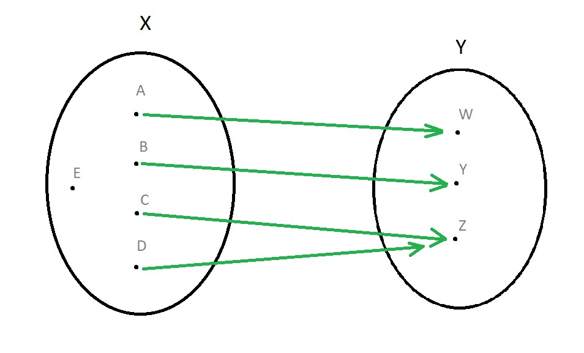
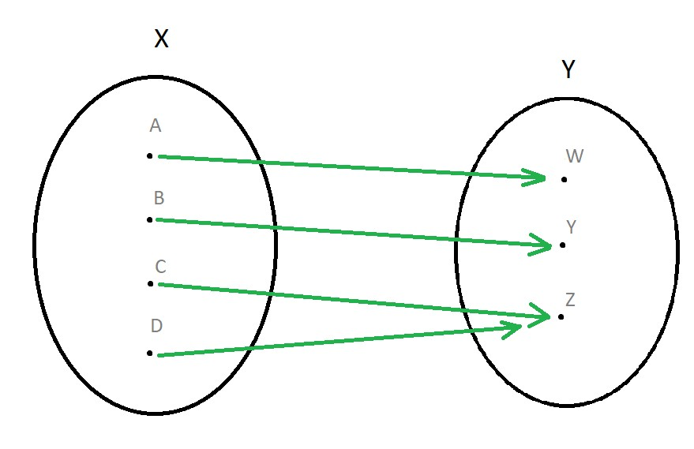

### Что такое класс Object? Какие в нем есть методы?

Класс Object является корневым классом для всех остальных классов в Java. **Все классы в Java являются подклассами
класса Object, непосредственно или косвенно**. Поэтому ссылочная переменная класса Object может ссылаться на объект
любого
другого класса. Так как массивы являются тоже классами, то переменная класса Object может ссылаться и на любой массив.

```java
// применимо к любому классу
Object obj = new Cat("Barsik");
```

В таком виде объект обычно не используют. Чтобы с объектом что-то сделать, нужно выполнить приведение типов.

```java
Cat cat = (Cat) obj;
```

**Методы класса Object в Java:**

1. Object clone() - метод позволяет клонировать объект: создает дубликат объекта.

------

2. boolean equals(Object obj) - определяет, равен ли один объект другому
3. int hashCode() - возвращает хеш-код, связанный с вызывающим объектом

------

4. final native Class getClass() - Возвращает специальный объект, который описывает текущий класс.

---

5. public final native void notify() - возобновляет выполнение потока, который ожидает вызывающего объекта
6. public final native void notifyAll() - возобновляет выполнение всех потоков, которые ожидают вызывающего объекта
7. public final native void wait(long timeout)  - ожидает другого потока выполнения
8. public final void wait(long timeout, intnanos) - ожидает другого потока выполнения
9. public final void wait() - ожидает другого потока выполнения

----

10. public String toString() - возвращает символьную строку, описывающую объект
11. protected void finalize() throws Throwable - вызывается сборщиком мусора, когда он определяет, что на объект больше
    не существует ни одной ссылки

**Методы getClass(), notify(), notifyAll(), wait() являются финальными и их нельзя переопределять.**

**Метод .equals()**

**Отношение эквивалентности (алгебра)**

Прежде чем поговорить о методе .equals, я бы хотел рассказать, что такое отношение эквивалентности с точки зрения
алгебры (пока-что забудьте про программирование).

Отношение эквивалентности - это бинарное (бинарное - значит между двумя) отношение, которое является:

* симметричным (для любых x, y выполняется: если x = y, то y = x)
*
* рефлексивным (для любого x выполняется: x = x)
*
* транзитивным (для любых x, y, z выполняется: если x = y и y = z, то x = z)

Таким образом, если на множестве определено отношение эквивалентности, множество можно разделить на подмножества -
классы эквивалентности.

Каждый класс эквивалентности содержит внутри себя только те элементы, которые эквиваленты (более формально - находятся в
отношении эквивалентности) между собой.

**Реализация .equals() по умолчанию**
Метод .equals() в классе Object реализован примерно следующим образом:

```java
public boolean equals(Object x) {
    return (this == y);
}
```

Фактически он делает следующее: Он принимает в качестве аргумента ссылочную переменную и проверяет, ссылается ли они на
тот же объект (ту же область памяти, если быть точнее), что и объект, к которому мы применили метод .equals().

**Таким образом, стандартная реализация .equals() выстраивает отношение эквивалентности, которое можно описать так: две
ссылки эквивалентны, если они ссылаются на одну и ту же область памяти.**

Такая реализация не противоречит математической идеологии, описанной выше. Однако на практике метод .equals() часто
переопределяют в подклассах.

**Как и зачем переопределяют метод .equals()?**
Очевидно, гораздо более применимой будет возможность сравнивать объекты по какому-нибудь другому критерию. Часто метод
.equals() переопределяют так, чтобы он сравнивал объекты по значениям их полей.

К примеру, если классы двух объектов, на которые указывают ссылки, совпадают и все значения их полей совпадают, то эти
два объекта эквивалентны между собой. Легко проследить, что такое определение не противоречит математической идеологии.

Конкретную кодовую реализацию я приводить не буду, потому что она не так важна, как сама идея

Это и другие возможные переопределения метода .equals() мало того, что расширяют круг наших возможностей, так ещё и не
лишают старых, ведь мы по прежнему имеем возможность проверять, ссылаются ли две ссылки на одну область памяти,
используя операнд ==, вместо прежнего .equals()

return(ob1 == ob2);

**Правила переопределения
При изменении работы метода нужно придерживаться правил переопределения equals() в Java:**

1. Если объект сравнивается сам с собой, должно возвращаться True.
2. Если объект сравнивается с null, должно возвращаться False.
3. При равенстве двух объектов Obj1.equals(Obj2) и Obj2.equals(Obj1) должны возвращать True.
4. При сравнении трёх объектов Obj1.equals(Obj2) и Obj2.equals(Obj3) возвращают True, то и Obj1.equals(Obj3) должно
   вернуть
   True.
5. При многократных вызовах метода должен возвращаться один и тот же результат, пока не изменятся свойства объекта,
   используемые в вашей реализации.

Существуют также некоторые ограничения на переопределение equals(). Например, переопределять метод нет смысла, если
каждый объект уникален. Кроме того, это относится к классам, которые предназначены не для работы с данными, а для
предоставления определённого поведения.

Ещё одна ситуация, когда метод не переопределяют, — использование класса, экземпляры которого сравнивать бессмысленно.
Наглядный пример — java.util.Random. Суть этого класса в том, чтобы возвращать случайные последовательности чисел.
Экземпляры этого класса не должны быть равными, иначе в них нет смысла.

**Метод .hashcode()**

**Сюръекция (алгебра)**
Сюръекция - сопоставление элементам множества X элементов второго множества Y, при котором для любого элемента из Y есть
хотя-бы один сопоставленный элемент из X.

Если немного более подробно разобрать это определение, то мы увидим следующее:

* Даже несколько элементов из X могут быть сопоставлены одному и тому же элементу из Y (это называется коллизией).

* Возможно есть такое элемент из X, и даже возможно не один, что он не сопоставлен никакому элементу из Y. (см. рисунок,
  всё интуитивно)
  

**Что происходит в java?**

Метод .hashcode() как-раз осуществляет сюръекцию. Множеством X выступает множество всевозможных объектов которые мы
можем создать, множеством Y выступает область значений типа данных int. Метод .hashcode() вычисляет каким-то скрытым от
нас способом целое число, опираясь на объект, к которому применяется.

Единственное отличие метода .hashcode() от сюръекции в том, что любой объект может быть обработан методом .hashcode()



**Реализация .hashcode() по умолчанию?**
Насколько я понял, точно так никто в этом и не разобрался. Есть много версий:

Значение .hashcode() - это область памяти, где лежит объект

Значение .hashcode() - это число, создаваемое генератором случайных чисел в какой-то момент

Сама функция написана не на Java а вообще на C.

И многие другие. В общем каким-то образом она всё же устроена, но самое главное в том, что стандартная реализация
.hashcode() со стандартной реализацией .equals() подчиняются правилу, приведённому в самом начале статьи

**Как и зачем переопределяют метод .hashcode()?**
Основной причиной для изменения метода .hashcode() является то, что желают изменить .equals(), однако смена стандартной
реализации .equals() приводит к нарушению правила из начала статьи

В определении хэш-значения должны принимать участие только те поля, которые используются в equals(). Кроме того, нужна
база — основу для вычисления хэша. Обычно базой делают число 31, но вы можете установить любое другое значение.

Правила вычисления:

Переменной result присваивается ненулевое значение — например, число 31.
**Для каждого значимого поля экземпляра вычисляется хэш. Правила вычислений отличаются в зависимости от типа поля:**
* для boolean — (f ? 1 : 0);
* для byte, char, short или int — (int) f;
* для long — (int)(f ^ (f >>> 32));
* для float — Float.floatToIntBits(f);
* для double — Double.doubleToLongBits(f), а затем как с long;
* для полей, которые представляют собой ссылку на другой объект — рекурсивный вызов hashCode();
* для null — вернуть 0;
* для массива — обработайте так, будто каждый элемент представляет собой отдельное поле объекта.
После обработки каждого поля вы должны прибавлять полученный результат к базе и предыдущим результатам. После
прохождения по всем полям верните итоговый хэш-код.